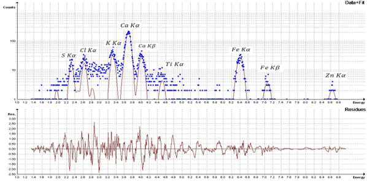
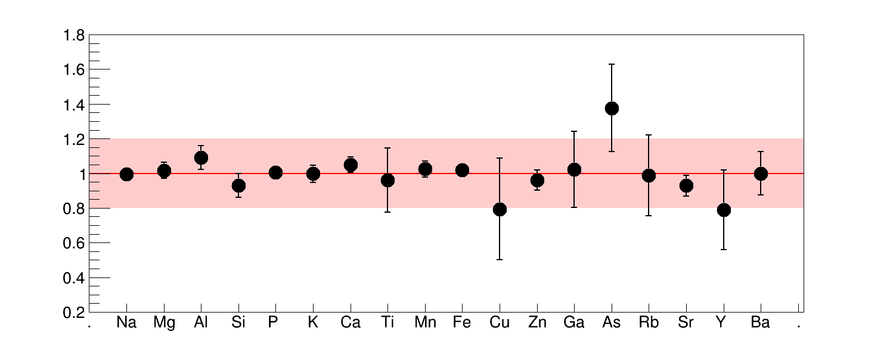

* A reliable procedure for PIXE analysis of thick target sample has been developed, calibrated and standarlized. As part of the QA/QC protocol of the laboratory, several standard samples measured using our thick target PIXE (TTPIXE) analysis procedure. The result indicates good accuracy in determination of trace element concentration over a wide range of elements. The relative differences between measured and certified values are mostly bellow 20 %. 
* In 2013, about 500 of sediment samples collected near the coastline have been analyzed by PIXE system in the laboratory. Geological samples were extensively  analyzed since then.
* Analysis of aerosol samples collected at several sites in Vietnam is being proposed.

*PIXE spectrum of an aerosol sample collected in Hanoi urban area. A noticable Calcium content was detected, presumably due to construction works in the area*

*The ratio of measured and certified concentration of IAEA-Soil7 standard sample*