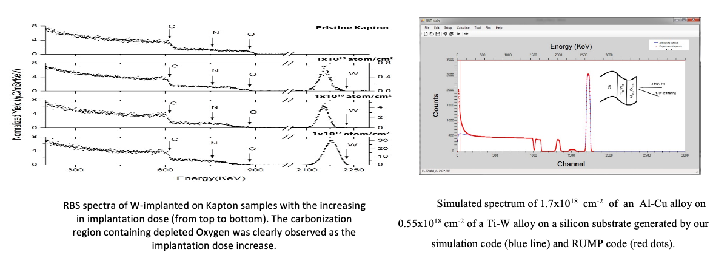

Among the research activities on the RBS system of the HUS Pelletron Laboratory: 

* A computer program has been developed in the HUS Pelletron Laboratory to sinulate RBS spectra with similar features with the popular program RUMP.

* A procedure for optimization of the experimental condition has been proposed based on parameters deduced from the simulation code.

*RBS spectra acquired using IBA beamline of the HUS Pelletron and RBS simulation code developed by our Laboratory*
