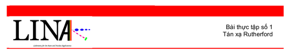

For years, our facility offers students many chances to experience an accelerator facility:  beam optics, vacuum components and ion sources

Student experiments: <a href="./exp_rbs_vi.pdf"> Rutherford experiment</a>  , <a href="./exp_pixe_en.pdf">PIXE analysis of thin and thick samples</a>.

Numbers of undergraduate essays and master’s theses have been done in the laboratory.

