The study of nuclear reactions with light particles in low energy regions, in addition to contributing to a deeper understanding of the characteristics of nuclear reactions, the structure of nuclear excitation states, also provides important information about the phenomena that occur in stars, about the changes in the universality of elements in the universe. Nuclear reactions in nuclear astrophysics often have small reaction cross-sections, occurring in low-energy regions, in order to study them it is necessary to have a radionuclide beam of low energy and sufficiently large intensity. Tandem-type electrostatic accelerators are instrumental in meeting these requirements. For decades electrostatic accelerators have played an important role in research as well as application. It is a tool heavily used in studies of low - energy nuclear physics, nuclear astrophysics, and heavy ion physics.

An overview of the possibility of conducting experiments to study nuclear reactions in low energy areas used in nuclear astrophysics on the Pelletron accelerator 5SDH-2 at the School of Natural Sciences - Hanoi National University.

**1\. LOW ENERGY physics RESEARCH ON TANDEM SPEED MACHINE**

In recent years, nuclear physics has expanded the scope of research in many different fields, including important contributions to a more complete understanding of the formation and evolution of the universe. Nuclear reactions in the low energy region play a major role in these processes. The purpose of nuclear physics experiments in astronomical research is to determine the speed of nuclear reactions that occur in stars under different conditions. Reaction speed is an important factor for understanding the distribution of isotope richness in stars. Reaction speed is determined from the reaction cross-section measured at energy regions close to astrophysical energy. In the majority of experiments cross-section is determined by directly measuring the product particles on the beam (in-beam) or recording instantaneous gamma rays to cleave the defined reaction channels. In many cases the product nuclei of the reaction are radioactive isotopes with long enough lifetimes to allow cross-section determination based on indirect (off-line) measurements recording delayed gamma rays or X-rays, this technique is also known as the activation method. In case the reaction products have too long lifetime, weak activity can use AMS acceleration spectrometer mass method \[1,2\].

For direct measurement, most astrophysical reactions are capture reactions of light particles such as protons, alphas and also neutrons in some environments. To measure the capture reactions, beams of light particles are accelerated and bombarded with beers containing elements capable of capturing particles. Since the capture reactions are usually measured in low energy regions, the beer nuclei are heavier than the incoming particles, the reaction products usually stop in the volume of the beer. Gamma rays emitted by de-excitation are recorded to identify events from nuclear reactions, their intensity reflecting the speed or cross-section of the nuclear reaction.

In fact, the major challenge for measuring important astrophysical reactions is that during the main stages of stellar burning, reaction rates are often very low, only isotopes with very long lifetimes contribute, and short-lived components decay before they can participate in the reaction. For reactions with very small cross-sections, large incoming beams of particles, pure beer, and a low environmental background are required. It is therefore common to use high - intensity, low - energy beams of particles produced on electrostatic accelerators, measurements made in a special laboratory to ensure the background reduction to the lowest possible level, this method is suitable only for nuclei with a sufficiently long lifetime. In many cases, direct measurement of the rate of an astrophysical reaction is not possible due to too low cross-section or difficult beam and beer requirements. Then indirect measurement techniques will be implemented, for example, characteristic measurement of other reactions and used to calculate the speed of important reactions in astrophysics.[3,4\]

Elements H, He, Li, Be, B play important roles in the field of nuclear astrophysics, in the synthesis of elements on stars. Among the nuclear reactions heavily used in nuclear astrophysics research, 10B(p,α)7Be is considered an important reaction in the pp cycle and some subsequent cycles, with only a small number of resonance levels in the 11C component nucleus located in the Gamow window of the reaction (0.5 – 1.5 MeV) participating in the 10B(p,α)7Be nuclear reaction. The 10B(p,α)7Be reaction is seen as the primary process of destroying 10B as well as altering the abundance of light elements. The characterization of these resonance levels will allow the rate of this reaction to be calculated in stars. It is also possible to study the 10B(p,α)7Be reaction combining the reverse kinetic method in nuclear reactions to calculate the cross section of the 7Be(α,p)10B reaction. There has been a lot of recent research on this reaction, however the results obtained from different groups of authors compiled on the EXFOR data library show significant differences between the data.

The 10B(p,α)7Be reaction is of great interest in various fields such as nuclear astronomy, nuclear physics, new nuclear reactor technology for clean energy. A. Caiolli et al. studied this reaction on AN2000 electrostatic accelerator at INFN laboratory. The total cross-section of the reaction was measured in the energy region of the proton beam from 250 - 1182 keV by activation method. The decays of the 7Be nucleus were measured on a low-profile HPGe spectrometer (Fig 1) \[6\].

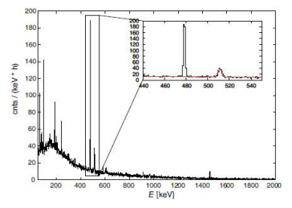

_Figure 1. 7Be's gamma spectrum measured on the HPGe gamma spectrometer for 6 hours, the red part of the spectrum is the spectrum measured for 100 hours.

M. Wiescher et al. performed experiments to determine the cross section of the 10B(p,α)7 Be reaction in the proton beam energy range of 400-1000 keV using particle recognition and gamma spectroscopy techniques for an energy range of 80-1440 keV (Figure 2). I. Lommardo et al. performed another study of the 10B(p,α)7 Be reaction at low energy (Ep = 630-1280 keV) using the Tandem TTT3 accelerator in Naples.

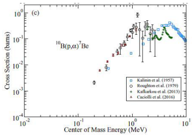

_Figure 2. Reaction cross-section 10B(p,α)7 Be measured by different author groups \[5\]_

Besides the 10B(p,α)7Be reaction, the 10B(α,p)13C reaction also plays an important role in the formation of heavier nuclei from light particles during the evolution of the elements of the universe. Currently, simulation calculations have not yet explained the results of experimental abundance of heavy elements in the CNO region due to the lack of data on the quantity and experimental cross-section of reactions in this low energy region. H. Chen et al. measured the cross section of the reaction 10B(α,p)13C at a 90o angle with the alpha particle beam energy of 1.4 to 5.3 MeV emitted by the 5SDH-2 Pelletron accelerator at the University of Houston Center for Superconductivity and Advanced Materials (Figures 3, 4, 5).

The method of radioactive activation and delayed gamma spectrometry using HPGe ultra-pure semiconductor spectrometers is also heavily used in nuclear reaction research on electrostatic accelerators. Figure 5 shows the activated gamma spectrum recorded on natural Sr beer after irradiation with a 3 MeV proton beam from the Tandem accelerator. Proton capture on three stable 84,86,87Sr isotopes forms radioactive 85,87,88Y isotopes. The decay of the three isotopes can be easily identified on the gamma spectrum. 85Y and 87Y have long lifetime isomerization states. Thanks to the different gamma radiation, we can measure the decay of the ground state and the isomerization states and cross sections that form these states.[2\]

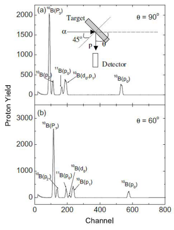

_Figure 3. The energy spectrum of the proton from reaction 10B(α,p)13C using natural boron, alpha particle beam energy is 1.515 MeV \[10\]_

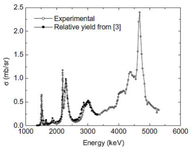

_Figure 4. The excitation function of reaction 10B(α,p)13C \[10\]_

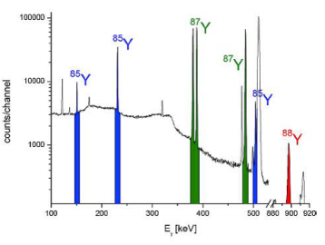

_Figure 5. The gamma spectrum of the natural Sr sample projected by the 3 MeV proton beam \[2\]_

**2\. Pelletron 5SDH-2 electrostatic accelerator **

Pelletron 5SDH-2 is a modern electrostatic accelerator, first available in Vietnam, installed at the School of Natural Sciences - Hanoi National University. This type of double electrostatic accelerator (Tandem), manufactured by National Electrostatics Corporation (NEC) - USA. The maximum acceleration voltage is 1.7 MV, so it can accelerate protons up to 3.4 MeV, alpha particle beam up to 5.1 MeV. The 5SDH-2 Pelletron accelerator consists of the following main components: ion source, main acceleration chamber, vacuum system, convergence components, beam adjustment, analysis channel and ion implantation channel, etc.

The ion source of the accelerator consists of two types: (1) The cathode sputtering ion source (SNICS) allows the generation of negative ions from H to Bi for acceleration; (2) The charge-exchanging negative ion source (RF) allows the generation of H- and He- ions for acceleration and the beaming of protons and alpha particles for the analysis channel.[12-14\].

The system of detectors in the projection chamber, measurement of the analysis channel includes: 01t flashing detector NaI (Tl) placed after the location of the sample used for NRA analysis system; 02 silicon fence detector SSB, a detector placed at the scattering angle for the incident beam of 170o used for RBS analysis, the second detector can be rotated at any angle around the sample; 01 X-ray detector type SDD placed at an angle of 38.4o from the direction of the incident beam from the sample used for PIXE analysis system. The signals from the detector enter the amplifier and through the ADC converter and MCA multi-channel amplitude analyzer. The spectrum is recorded and analyzed on the computer with specialized software such as MAESTRO, RC43, SIMNRA,..

Pelletron accelerator 5SDH-2 can be used in a variety of applied research fields such as nuclear physics research, heavy ion physics, nuclear astrophysics; Nuclear fuel research, radiochemistry; Materials science, semiconductor physics, surface physics, physicochemical corrosion; Applications in the field of archaeology, medicine, biology, agriculture, geology, environment, oceanography, criminal science and criminal tracing.

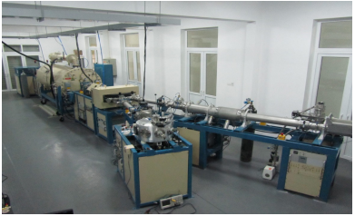

_Figure 6. Actual image of Pelletron accelerator 5SDH-2_

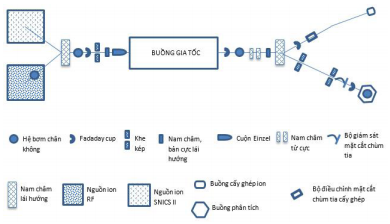

_Figure 7. Structural diagram of Pelletron accelerator 5SDH-2_

Figures 6, 7 are actual images and schematic diagrams of the structure principle of the Pelletron accelerator 5SDH-2 at the University of Natural Sciences - Hanoi National University.

For nuclear reaction studies we need to know exactly what is the energy of the accelerated particle beam and its energy resolution. Usually for particle accelerators, the information about the energy of the particle beam is determined through intermediate quantities related to the parameters of the accelerator. However, the energy value determined by this method for accuracy is not high, especially for studies requiring to know the energy of the particle beam with high accuracy. The method uses resonant nuclear reactions to standardize the accelerator particle beam energy is a technique commonly used for Tandem accelerators.

N. T. Nghia et al. used the 27Al(p,γ)28Si resonance reaction to calibrate the energy of the proton beam on the 5SDH-2 Pelletron Accelerator.

**3\. Prospects for research in nuclear physics using the 5SDH-2 Pelletron Accelerator**

Up to now, there are few experimental studies on nuclear reactions caused by charged particle beams generated on accelerators in Vietnam. On Pelletron 5SDH2, besides the exploitation in research and application of analytical methods and equipment such as RBS, PIXE, NRA in the identification and determination of element content in different sample objects. A number of studies on the properties of materials, structures of specimens such as layer thickness, composition of specimens, etc. have also been carried out on this device.

N. T. Nghia et al. have some initial results of research on nuclear physics and methods, analytical techniques on the Pelletron accelerator.[12-15\] T. T. Anh conducted a preliminary study measuring the yield and cross section of the 10B(p,α)7Be reaction caused by an energy proton beam from 0.8 MeV to 2.5 MeV by means of activation and instantaneous gamma measurement.

In recent times, studies on astrophysical-related nuclear reactions caused by beams of protons and alpha particles from the 5SDH-2 Pelletron accelerator have begun to be carried out. The National Scientific and Technological Project Group under the Physics Development Program to 2020 by TS. Le Xuan Chung, the director, is gradually conducting research on nuclear reactions in low energy areas used in astronomy on the 5SDH2 Pelletron accelerator. The project gathered a large team of experimental nuclear physics researchers from various research and training institutions in the country such as the Institute of Nuclear Science and Engineering, Hanoi University of Natural Sciences, Da Nang VINAGAMMA Center, Ho Chi Minh City University of Natural Sciences. The team also received enthusiastic help from GS. Kubono from Tokyo University. The reactions to be studied are 10B(α,p)13C and 10B(p,α)7Be, in addition, the reactions 10B(p,p)10B and 10B(p,γ)11C\* will also be of interest. The team has some initial results in the implementation of simulation calculations, experimental design, construction, installation of measuring systems, brewing, and implementation of experimental experiments. 

The first step has been obtained there are some calculations simulating the reaction 10B(α,p)13C using Geant4, with 2 main modules: (1) calculating the interaction cross-section of the reaction and (2) calculating the particles in the final state as well as their kinetic energy distribution. The total cross-section of the reaction α+10,11B is calculated using Talys 1.9 code (Fig 8), these values will be the input of Geant4 program.

The energy spectrum of the α beam in Boron beer with different thicknesses of beer (Fig 9). To design the geometry of the detector layout of the experiment, the energy of the particles at the angle of flight was calculated. The result of simulating the energy spectrum of charged particles recorded by the silicon detector at 120o angle with beer with a thickness of 10 μg/cm2 is shown in Figure 10 \[18\].

The 10B(α,p)13C reaction cross-section and yield measurement experiment will be performed with a beam of α particles with energy from 0.7-1.5 MeV, at different angles. The experiment diagram is shown in Figure 11, with aSi as Si semiconductor detectors measuring the energy of charged particles that fly out after the reaction, natural Boron beer is made in the form of a thin foil, FC as Faraday cup to measure the particle strength, the experiment layout is located in a high vacuum chamber.

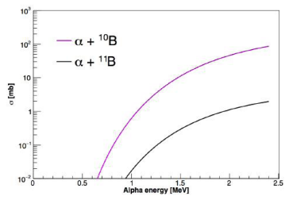

_Figure 8. Total cross section calculation of α+10,11B reactions by Talys 1.9 code_

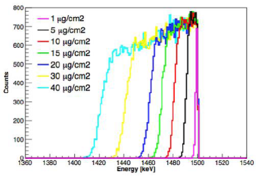

_Figure 9. Energy spectrum of α beam in Boron beer with different thicknesses_

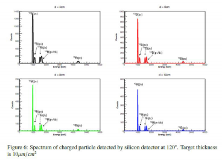

_Figure 10. Spectrum of charged particles recorded by Silicon detector at 120o angle. Beer with thickness of 10 μg/cm2 \[18\]_

To supplement as well as improve the accuracy of the cross section data proposed to conduct this experiment with a proton beam with energy decomposition from 700 keV to 3.4 MeV from the accelerator 5SDH-2 Pelletron, the measurement of gamma radiation and alpha particles flying out is conducted simultaneously. In addition, detectors will be arranged around the beer to measure the dependence of the cross section by angle. At energy Ep>3.2 MeV, it is possible to open the reaction channel producing 7 Be in a higher excited state. The experimental layout is shown on Figure 12.

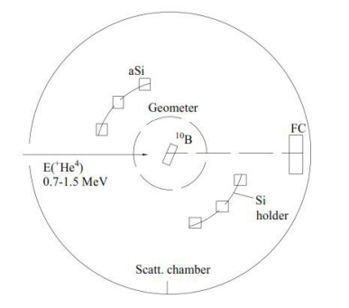

_Figure 11. Diagram measuring reaction 10B(α,p)13C_

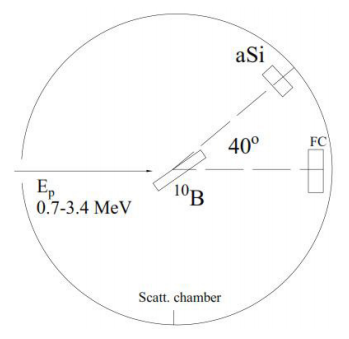

_Figure 12. Diagram measuring reaction p+10B_

In the study of nuclear reactions, measurement systems, in addition to achieving high accuracy, must also have flexibility and meet many other requirements. Therefore, the construction of a measurement system from the assembly of discrete electronic blocks is the optimal option for experimental research equipment in nuclear physics. The current trend of the world is to switch to the use of VME systems to achieve the advantage of the number of channels that the electronic and mechanical system does not have too bulky. The research group under the Physical Development Program led by Dr. Le Xuan Chung has successfully designed and built a multi-parameter VME measuring system (Fig 13, 14) that can be used in many different purposes of nuclear physics research (Fig 15), \[17\]. With the VME measuring system, it is possible to simultaneously measure charged particles and gamma rays. In the future, this will allow the team to perform many complex nuclear physics problems that require accurate channel recognition.

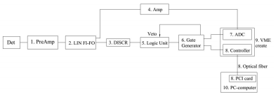

_Figure 13. Diagram of VME Multiple Parameter Measurement System Principle

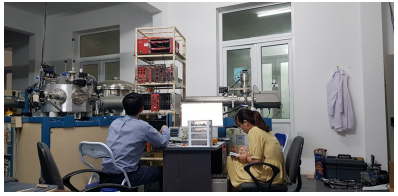

_Figure 14. Image of VME multi-parameter measuring system

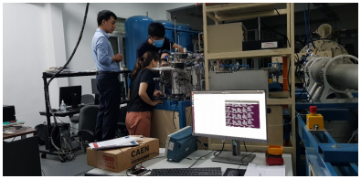

_Figure 15. Image of preparation for nuclear reaction research experiment on Pelletron accelerator 5SDH-2 at Hanoi University of Sciences_

**4\. CONCLUSIONS**

With Tandem Pelletron 5SDH-2 accelerator at the University of Science - Hanoi National University and a system of modern VME measuring instruments that have been built at the Institute of Nuclear Science and Engineering, together with the capacity, experience and passion for nuclear physics research of Vietnam's young researchers, the ability to successfully conduct researches in modern nuclear physics in general, nuclear reactions in low energy areas used in nuclear astrophysics in particular are really being launched in Vietnam.

On the basis of the existing and continued investment in equipment, human resources and funding, in the coming time, the scope and efficiency of exploitation of Pelletron accelerator 5SDH-2 in research and application in Vietnam will be increasingly expanded.

_References_

_\[1\] Michael Wiescher, “The Four Lives of a Nuclear Accelerator”, Phys. Perspect. 19 (2017) 151–179._

_\[2\] Gy. Gyurky, Zs. Fulop et al., “The activation method for cross section measurements in nuclear astrophysics”, Eur. Phys. J. A (2019) 55: 41._

_\[3\] D.Tudor et al., “Facility for direct measurements for nuclear astrophysics at IFIN-HH - a 3 MV tandem accelerator and an ultra-low background laboratory”, Nucl. Inst. and Meth. in Phys. Res. B 953 (2020) 163178._

_\[4\] S. D. Pain , “Advances in instrumentation for nuclear astrophysics” AIP ADVANCES 4, 041015 (2014)._

_\[5\] M. Wiescher, R. J. de Boer, and J. Görres, “Low energy measurements of the 10B(p,α)7 Be reaction”, Physical Review C 95, 044617 (2017)._

_\[6\] A. Caciolli, R. Depalo et al. “A new study of 10B(p,α)7 Be reaction at low energies”, Eur. Phys. J. A (2016) 52: 136._

_\[7\] C. Spitaleri et al. “Measurement of the 10B(p,α0)7 Be cross section from 5 keV to 1.5 MeV in a single experiment using the Trojan horse method”. Physical Review C 95, 035801 (2017)._

_\[8\] Lombardo, D. Dell’Aquila, “New measurement of the 10B(p,α0)7 Be reaction cross section at low energies and the structure of 11C”, EPJ Web of Conferences, 117 7, 09009 (2016)._

_\[9\] H. Yamaguchi,... D. N. Binh, L. H. Khiem, N. N. Duy,” Alpha-resonance structure in 11C studied via resonant scattering of 7 Be+alpha and with the 7 Be(α,p) reaction. Physical Review C 87 (3) (2013) 034303._

_\[10\] H. Chen et al., “Cross-sections of 10B(α,p)13C nuclear reaction for boron analysis”, Nucl. Instr. Meth. B 211 (2003) 1._

_\[11\] T. Trivedi et al. “Ion Beam Facilities at the National Centre for Accelerator based Research using a 3 MV Pelletron Accelerator”, Physics Procedia 90 (2017) 100-106._

_\[12\] Nguyen The Nghia, Nguyen Thi Lan, Le Hong Khiem, Vi Ho Phong, Bui Van Loat, Tran The Anh. Using resonant nuclear reaction 27Al(p,γ)28Si to calibrate beam energy for pelletron accelerator 5SDH-2 at Hanoi University of Science: Nuclear Science and Technology - Vol. 3, No. 3 (2013)._

_\[13\] Nguyen The Nghia, Vu Thanh Mai, Bui Van Loat, “The model 5SDH-2 pelletron accelerator and application”. VNU Journal of Science, Mathematics-Physics, 27, 1S (2011) 180-184._

_\[14\] Le Hong Khiem, Vi Ho Phong, Nguyen The Nghia, “Calculation for optimization of the experimental conditions for RBS analysis at the HUS 5SDH-2 tandem accelerator”. IOP Science. Journal of Physics: Conference Series 627 (2015) 012005._

_\[15\] Nguyễn Thế Nghĩa: “Nghiên cứu ứng dụng một số phản ứng hạt nhân gây bởi chùm hạt tích điện trên máy gia tốc tĩnh điện trong phân tích”, Luận án Tiến sĩ, 2015._

_\[16\] Trần Thế Anh: “Bước đầu nghiên cứu phản ứng hạt nhân 10B(p,α) trên máy gia tốc 5SDH-2 tại Trường Đại học Khoa học tự nhiên”. Luận văn Thạc sĩ, 2013._

_\[17\] Lê Xuân Chung và cs “ Nghiên cứu cấu trúc hạt nhân và phản ứng hạt nhân trên các thiết bị lớn của Trung tâm nghiên cứu hạt nhân tiên tiến trên thế giới”. Đề tài KHCN cấp Quốc gia thuộc Chương trình phát triển Vật lý (2018-2020)._

_\[18\] Cuong Phan Viet, Anh Le Tuan, Chung Le Xuan, Ha Nguyen Hong, Thao Ho Thi and Khue Pham Duc, “Possibility for nuclear physics study based on Pelletron accelerator at Hanoi, Vietnam”, EPJ Web of Conferences 206 (2019) 08004._

 

Phạm Đức Khuê

Institute for Nuclear Science and Technology (INST)

_**Journal of Nuclear Science and Technology Information No. 63 06/2020**_

 
