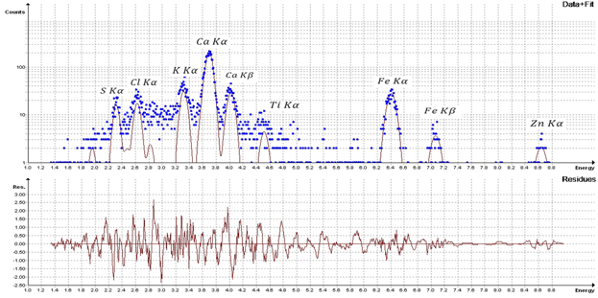
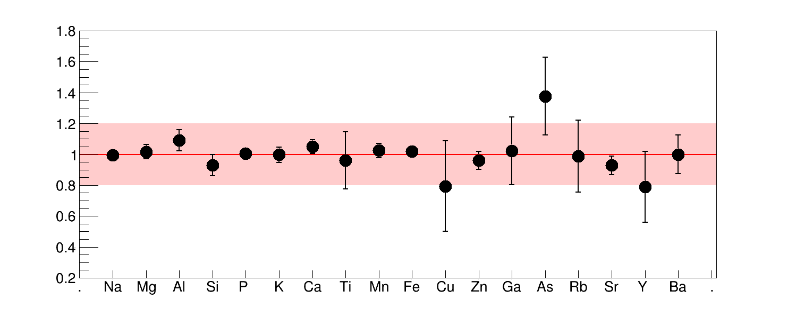

* Một quy trình đáng tin cậy để phân tích PIXE của mẫu mục tiêu dày đã được phát triển, hiệu chuẩn và standarlized. Là một phần của giao thức QA / QC của phòng thí nghiệm, một số mẫu tiêu chuẩn được đo bằng quy trình phân tích PIXE (TTPIXE) mục tiêu dày của chúng tôi. Kết quả cho thấy độ chính xác tốt trong việc xác định nồng độ nguyên tố vi lượng trên một loạt các yếu tố. Sự khác biệt tương đối giữa các giá trị đo và chứng nhận chủ yếu nằm dưới 20 %. 
* Trong năm 2013, khoảng 500 mẫu trầm tích được thu thập gần bờ biển đã được phân tích bởi hệ thống PIXE trong phòng thí nghiệm. Các mẫu địa chất đã được phân tích rộng rãi kể từ đó.
* Đề xuất phân tích các mẫu khí dung được thu thập tại một số địa điểm ở Việt Nam.

*Phổ PIXE của một mẫu khí dung được thu thập tại khu vực đô thị Hà Nội. Một hàm lượng Canxi đáng chú ý đã được phát hiện, có lẽ là do các công trình xây dựng trong khu vực*

*Tỷ lệ nồng độ đo và chứng nhận của mẫu chuẩn IAEA-Soil7*