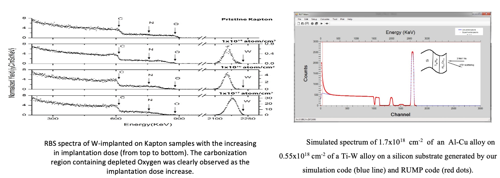

Trong số các hoạt động nghiên cứu trên hệ thống RBS của Phòng thí nghiệm HUS Pelletron: 

* Một chương trình máy tính đã được phát triển trong Phòng thí nghiệm HUS Pelletron để Sinulate phổ RBS với các tính năng tương tự với chương trình phổ biến RUMP.

* Một quy trình tối ưu hoá điều kiện thí nghiệm đã được đề xuất dựa trên các tham số được suy ra từ mã mô phỏng.

*Phổ RBS thu được bằng cách sử dụng chùm tia IBA của HUS Pelletron và mã mô phỏng RBS được phát triển bởi Phòng thí nghiệm của chúng tôi*
