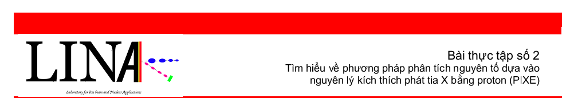
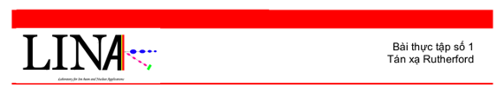

Trong nhiều năm, phòng máy gia tốc cho phép sinh viên có những trải nghiệm thực tế về một cơ sở máy gia tốc như: hệ quang học chùm tia (beam optics), các bộ phận chân không, nguồn ion v.v...

Một số bài thực tập đã được xây dựng và tiến hành trên hệ máy gia tốc như: <a href="./exp_rbs_vi.pdf"> Thí nghiệm Rutherford</a>  , <a href="./exp_pixe_en.pdf">Thực tập phân tích PIXE trên các mẫu dày và mẫu mỏng</a>.

Nhiều khoá luận sinh viên và luận văn thạc sĩ đã được hoàn thành trên cơ sở các thực nghiệm tiến hành tại phòng máy gia tốc.

