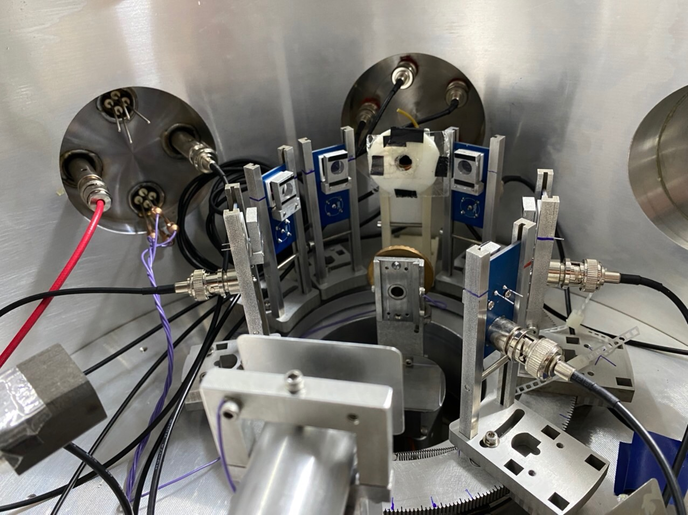
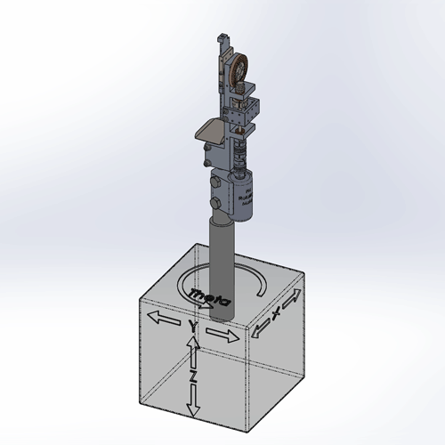
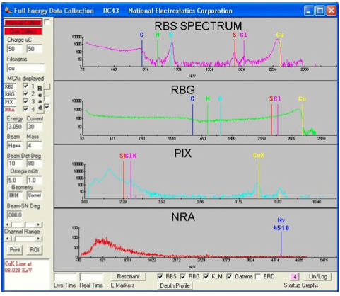

Ion beam analysis ("IBA") is an important family of modern analytical techniques involving the use of MeV ion beams to probe the composition and obtain elemental depth profiles in the near-surface layer of solids. All IBA methods are highly sensitive and allow the detection of elements in the sub-monolayer range. The depth resolution is typically in the range of a few nanometers to a few ten nanometers. Atomic depth resolution can be achieved, but requires special equipment. The analyzed depth ranges from a few ten nanometers to a few ten micrometers. IBA methods are always quantitative with an accuracy of a few percent. Channeling allows to determine the depth profile of damage in single crystals.<a href="https://en.wikipedia.org/wiki/Ion_beam_analysis">[*]</a>

### Applications

The RC43 endstation is capable of many IBA techniques, each of which have a long list of applications. Detectors can be included for the following techniques:

* Rutherford Backscattering (RBS) and Channeling.
* Elastic Recoil Detection (ERD) 
* Nuclear Reaction Analysis (NRA)
* Particle Induced X-ray Emission (PIXE) 

### Design

#### Chamber
The scattering chamber is constructed primarily from aluminum with a 17″ (43cm) inside diameter and an 8″ (20cm) inside height. The base of the chamber provides stable support for the target manipulator, solid state particle detector, beam collimator, and turbo-molecular pump. The chamber has a view port, target alignment laser, and video camera. A target load lock is placed in the lid to permit quick (less than 5 minute) changes of target holders while maintaining high vacuum.

The chamber can accommodate up to 16 samples, 1cm x 1cm, side by side. It is electrically isolated and can be used as a Faraday cup for precise beam current measurements.

*An interior view of the RC43 chamber*

#### Target Manipulator

The RC43 incorporates a manipulator with a motorized rotary drive. This manipulator allows precise control of target movement in the X, Y, and Z directions with polar and azimuthal rotation. The stepper motor controller interfaces with the control computer and will control all five motors at one time. Local control of the manipulator is also available when adding samples.

*Available directional and rotational control of the RC43 target manipulator*

#### Current Integrator

A digital current integrator is provided to measure total ion beam currents and provide gate signals for the RBS or NRA measurements by monitoring total ion current on the target.

#### Detector system

#####  RBS detector 

For RBS analysis, a Silicon Surface Barrier detector of 50 mm2 area, a detector preamplifier and conventional NIM electronics are employed. The detector is located at a scattering angle of 170o  with a solid angle of 3 msr.

#####   ERDA detector

An additional silicon surface barrier detector are used for ERD, or glancing RBS measurements. The ERD setup includes an insulated
feedthrough with a support arm to allow movement of the detector from 30° to 170°. An ERD foil holder is also mounted on the support arm with positions for up to 6 different foil thicknesses. The electronics include the detector preamp, bias supply, and related electronics.

#####   PIXE detector 

For PIXE analysis, a 25 mm2 Silicon Drift Detector (SDD) located at backward angle of 32.7 o to the beam direction is employed. Also included is a preamp, spectroscopy amplifier, power supply, X-rayfilter holder, MCA with KLM lines, and necessary cables. A modern, up-to-date computer with GUPIX analysis software, color monitor, keyboard, mouse, and stand are provided. Files of data acquired on the RC43
computer are easy to transfer directly to the PIXE analysis computer via Ethernet

#####   Gamma rays detector for NRA

For NRA analysis, a 2” x 2” NaI(T1) Scintillation Detector, preamplifier, amplifier and high voltage bias power supply are installed. A reentrant tube allows the detector to be closely placed directly behind the target.

#### Pumps and Valves

A turbo-molecular pump and forepump are furnished to pump the target chamber and beamline near the chamber and the target load lock.  Solenoid and pneumatic valves with appropriate controllers and gauges are provided to automatically pump out or vent the chamber.

#### Control and Data Analysis

Sample positioning and data acquisition with the RC43 endstation is accomplished with a remote control system. This control system includes software for both qualitative and quantitative analysis.

Qualitative analysis is performed by the RC43 Analytical Data Collection software.

###### Features:

* Up to 4 spectra can be gathered simultaneously including RBS, ERD, NRA, and PIXE
* Analysis of sample is fast, verified, qualitatively complete, and real time
* Capable of printing plots of channeling and microprobe data

*Data Collection Window*

Quantitative analysis is performed by the RUMP program developed by L.R. Doolittle of Cornell University, GUPIX program from University of Guelph, as well as other analysis programs.

###### Features:

* Allows for automatic calibration of the theoretical model and automatic chi-squared fitting of the model to the experimental data
* Data may be presented in either depth profile format, or various yield vs. energy formats
* An element’s surface scattering energy and height can be displayed
* Peak thickness can be calculated and a peak can be plotted in atomic fraction vs. depth format
* Up to 10 spectra can be plotted and overlaid with color and line styles automatically changed
* Selective plots of individual elements can be done to separate overlapping data
* The RC43 control system also communicates with the accelerator control system itself, receiving beam energy information and sending instructions to produce the optimal beam conditions during real time runs.

 
*Source: https://www.pelletron.com/products/rc43-analytical-endstation/*

