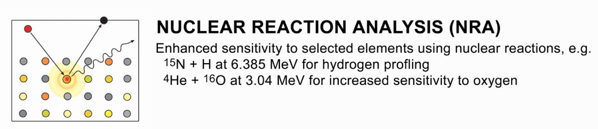
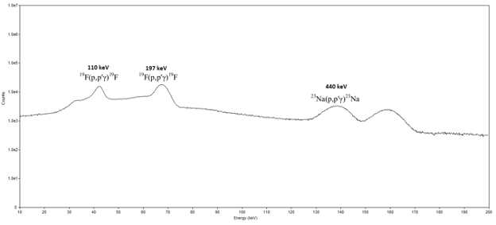
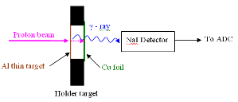
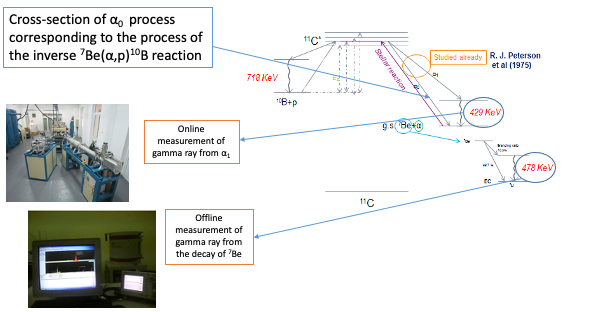
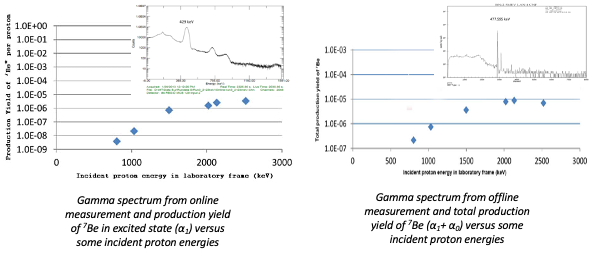
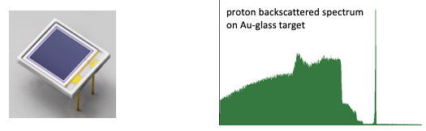
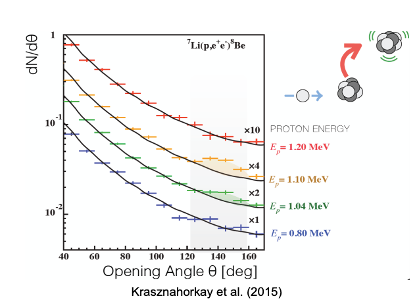

#### Nuclear Reaction Analysis (NRA): an analytical application of nuclear reaction

*Source: https://www.pelletron.com/wp-content/uploads/2017/05/Analysis-handout.pdf*

*Gamma-rays spectrum aqquired for NRA analysis at the HUS Pelletron*

#### Energy calibration for the accelerator by using nuclear resonance reactions 

* For studying nuclear reactions induced by charged particle beam, energy of beam delivered by the accelerator must be known exactly
* Energy calibration for the accelerator was carried out using resonance nuclear reaction 27Al(p,γ)28Si  in which the energies of resonances are known with very good accuracy
* This is a first nuclear reaction induced by charged particles experiment using our accelerator 

*The experimental set up*

*The dependence of 1776 keV peak area on the terminal voltage and the energy calibration curve*

#### Nuclear astrophysics study

##### 10B(p,α)7Be: test experiment for the inverse reaction  7Be(α,p)10B, relevant to the astrophysical νp-process

**10B(p,α)7Be: preliminary results from test experiment**

##### Direct measurement of 10B(α,p) cross-section, relevant to the astrophysical νp-process

**Si PIN detector test: Toward direct measurement of reaction cross-section**
  
* Measure energy spectrum and angular distribution of the reaction products: α, p directly using low cost newly developed Si PIN photodiode detector

##### A case study using pelletron accelerator: fundamental physics

* Abnomaly in e+e- invariant mass spectrum from 8Be  nuclear transition
* Possible explainations: new neural boson, dark matter, fifth force etc…
* An experiment at the HUS Pelletron is being proposed to reproduce this result

