Nghiên cứu phản ứng hạt nhân với các hạt nhẹ ở vùng năng lượng thấp bên cạnh việc góp phần hiểu biết sâu sắc hơn về đặc trưng của các phản ứng hạt nhân, cấu trúc các trạng thái kích thích hạt nhân, còn cung cấp các thông tin quan trọng về các hiện tượng xảy ra trong các ngôi sao, về sự thay đổi của độ phổ cập của các nguyên tố trong vũ trụ. Các phản ứng hạt nhân trong vật lý thiên văn hạt nhân thường có tiết diện phản ứng nhỏ, xảy ra ở vùng năng lượng thấp, để nghiên cứu chúng cần có chùm hạt nhân phóng xạ có năng lượng thấp và cường độ đủ lớn. Các máy gia tốc tĩnh điện loại Tandem là công cụ đáp ứng được các yêu cầu này. Trong nhiều thập niên qua máy gia tốc tĩnh điện đóng một vai trò quan trọng trong nghiên cứu cũng như ứng dụng. Đây là một công cụ được sử dụng nhiều trong các nghiên cứu vật lý hạt nhân năng lượng thấp, vật lý thiên văn hạt nhân và vật lý ion nặng.

Bài viết giới thiệu về tổng quan về khả năng thực hiện các thí nghiệm nghiên cứu phản ứng hạt nhân ở vùng năng lượng thấp dùng trong vật lý thiên văn hạt nhân trên thiết bị gia tốc Pelletron 5SDH-2 tại Trường Khoa học tự nhiên - Đại học Quốc gia Hà Nội.

**1\. NGHIÊN CỨU VẬT LÝ HẠT NHÂN NĂNG LƯỢNG THẤP TRÊN MÁY GIA TỐC TANDEM**

Trong những năm gần đây, vật lý hạt nhân đã mở rộng phạm vi nghiên cứu trong nhiều lĩnh vực khác nhau, trong đó có những đóng góp quan trọng trong việc hiểu biết một cách đầy đủ hơn về sự hình thành và tiến hóa của vũ trụ. Các phản ứng hạt nhân ở vùng năng lượng thấp đóng vai trò chính trong các quá trình này. Mục đích của các thí nghiệm vật lý hạt nhân trong nghiên cứu thiên văn là xác định tốc độ của các phản ứng hạt nhân xảy ra trong các sao trong các điều kiện khác nhau. Tốc độ phản ứng là một nhân tố quan trọng cho việc hiểu biết về phân bố độ giàu đồng vị trong các sao. Tốc độ phản ứng được xác định từ tiết diện phản ứng được đo tại các vùng năng lượng gần với năng lượng vật lý thiên văn. Trong phần lớn các thí nghiệm tiết diện được xác định bằng cách đo trực tiếp các hạt sản phẩm trên chùm (in-beam) hoặc ghi nhận các tia gamma tức thời để bóc tách các kênh phản ứng xác định. Trong nhiều trường hợp hạt nhân sản phẩm của phản ứng là các đồng vị phóng xạ có thời gian sống đủ dài cho phép xác định tiết diện dựa trên các phép đo gián tiếp (off-line) ghi nhận các tia gamma trễ hoặc tia X, kỹ thuật này còn được gọi là phương pháp kích hoạt. Trong trường hợp các sản phẩm phản ứng có thời gian sống quá dài, hoạt độ yếu có thể sử dụng phương pháp khối phổ kế gia tốc AMS \[1,2\].

Đối với phương pháp đo trực tiếp, hầu hết các phản ứng vật lý thiên văn là các phản ứng bắt (capture) các hạt nhẹ như proton, alpha và cả neutron trong một số môi trường. Để đo các phản ứng bắt hạt, chùm các hạt nhẹ được gia tốc và bắn phá vào các bia chứa các nguyên tố có khả năng bắt hạt. Do các phản ứng bắt hạt thường được đo ở vùng năng lượng thấp, các hạt nhân bia nặng hơn các hạt tới, các sản phẩm phản ứng thường dừng trong thể tích bia. Các tia gamma phát ra từ quá trình khử kích thích được ghi nhận để nhận diện các sự kiện từ các phản ứng hạt nhân, cường độ của chúng phản ánh tốc độ hay tiết diện của phản ứng hạt nhân.

Trên thực tế, thách thức lớn đối với việc đo các phản ứng vật lý thiên văn quan trọng, trong các giai đoạn chính của quá trình cháy sao, tốc độ phản ứng thường rất thấp, chỉ những đồng vị có thời gian sống rất dài mới có đóng góp, các thành phần sống ngắn sẽ bị phân rã trước khi chúng có thể tham gia phản ứng. Với các phản ứng có tiết diện rất nhỏ, đòi hỏi các chùm hạt tới có cường độ lớn, bia tinh khiết, và nền phông môi trường thấp. Do đó người ta thường sử dụng các chùm hạt có năng lượng thấp, cường độ lớn được tạo ra trên các máy gia tốc tĩnh điện, các phép đo được thực hiện trong phòng thí nghiệm đặc biệt để đảm bảo giảm phông nền đến mức thấp nhất có thể, phương pháp này chỉ thích hợp với các hạt nhân có thời gian sống đủ dài. Trong nhiều trường hợp việc đo trực tiếp tốc độ phản ứng vật lý thiên văn không thể thực hiện được do tiết diện quá thấp hoặc yêu cầu khó khăn về chùm hạt và bia. Khi đó các kỹ thuật đo gián tiếp sẽ được thực hiện, ví dụ đo đặc trưng của các phản ứng khác và sử dụng để tính toán tốc độ của các phản ứng quan trọng trong vật lý thiên văn \[3,4\].

Các nguyên tố H, He, Li, Be, B đóng vai trò quan trọng trong lĩnh vực vật lý thiên văn hạt nhân (nuclear astrophysics), trong quá trình tổng hợp các nguyên tố trên các sao. Trong số các phản ứng hạt nhân sử dụng nhiều trong nghiên cứu vật lý thiên văn hạt nhân, 10B(p,α)7 Be được xem là phản ứng quan trọng trong chu trình pp và một số chu trình tiếp theo, chỉ một số ít mức cộng hưởng trong hạt nhân hợp phần 11C nằm trong cửa sổ Gamow của phản ứng (0.5 - 1.5 MeV) mới tham gia vào phản ứng hạt nhân 10B(p,α)7 Be. Phản ứng 10B(p,α)7 Be được xem là quá trình chính của sự phá hủy 10B cũng như làm thay đổi độ phổ cập của các nguyên tố nhẹ. Việc nghiên cứu đặc trưng của các mức cộng hưởng này sẽ cho phép tính được tốc độ của phản ứng này trong các ngôi sao. Cũng có thể nghiên cứu phản ứng 10B(p,α)7 Be kết hợp phương pháp động học ngược trong phản ứng hạt nhân để tính tiết diện phản ứng 7 Be(α,p)10B. Gần đây đã có khá nhiều nghiên cứu về phản ứng này, tuy nhiên các kết quả thu được từ các nhóm tác giả khác nhau được tổng hợp trên thư viện số liệu EXFOR cho thấy còn có sự sai khác đáng kể giữa các số liệu \[5-9\].

Phản ứng 10B(p,α)7 Be được quan tâm nhiều trong các lĩnh vực khác nhau như thiên văn học hạt nhân, vật lý hạt nhân, công nghệ lò phản ứng hạt nhân mới cho năng lượng sạch. A. Caiolli và các cộng sự đã thực hiện nghiên cứu phản ứng này trên máy gia tốc tĩnh điện AN2000 tại phòng thí nghiệm INFN. Tiết diện tổng cộng của phản ứng được đo trong vùng năng lượng của chùm proton từ 250 - 1182 keV bằng phương pháp kích hoạt. Các phân rã của hạt nhân 7Be được đo trên hệ phổ kế HPGe phông thấp (Hình 1) \[6\].  

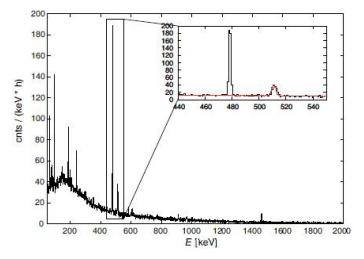

_Hình 1. Phổ gamma của 7Be đo trên hệ phổ kế gamma HPGe trong 6 giờ, phần phổ màu đỏ là phổ phông đo trong 100 giờ \[6\]_

M. Wiescher và cộng sự đã thực hiện các thí nghiệm xác định tiết diện của phản ứng 10B(p,α)7 Be trong khoảng năng lượng chùm proton từ 400-1000 keV sử dụng phương pháp ghi nhận hạt và dùng kỹ thuật năng phổ gamma đối với vùng năng lượng từ 80 - 1440 keV (Hình 2) \[5\]. I. Lommardo và cộng sự đã thực hiện một nghiên cứu khác về phản ứng 10B(p,α)7 Be ở mức năng lượng thấp (Ep = 630 -1280 keV) sử dụng máy gia tốc Tandem TTT3 tại Naples \[8\]. 

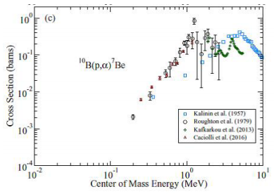

_Hình 2. Tiết diện phản ứng 10B(p,α)7 Be được đo bởi các nhóm tác giả khác nhau \[5\]_ 

Bên cạnh phản ứng 10B(p,α)7 Be, phản ứng 10B(α,p)13C cũng có vai trò quan trọng trong việc hình thành các hạt nhân nặng hơn từ các hạt nhẹ trong quá trình tiến hóa các nguyên tố của vũ trụ. Hiện nay, tính toán mô phỏng vẫn chưa giải thích được kết quả độ phổ cập thực nghiệm của các nguyên tố nặng trong vùng CNO do còn thiếu số liệu về suất lượng, tiết diện thực nghiệm của các phản ứng trong trong vùng năng lượng thấp này. H. Chen và cộng sự đã thực hiện thí nghiệm đo tiết diện của phản ứng 10B(α,p)13C ở góc 90o với năng lượng chùm hạt alpha từ 1.4 đến 5.3 MeV phát ra từ máy gia tốc 5SDH-2 Pelletron tại Trung tâm Siêu dẫn và Vật liệu tiên tiến thuộc Đại học Houston (Hình 3, 4 ) \[10\].

Phương pháp kích hoạt phóng xạ và đo phổ gamma trễ sử dụng phổ kế bán dẫn siêu tinh khiết HPGe cũng được sử dụng nhiều trong nghiên cứu phản ứng hạt nhân trên máy gia tốc tĩnh điện. Hình 5 cho thấy phổ gamma kích hoạt được ghi nhận trên bia Sr tự nhiên sau khi chiếu xạ với chùm proton 3 MeV từ máy gia tốc Tandem. Việc bắt proton trên ba đồng vị 84,86,87Sr bền tạo thành các đồng vị 85,87,88Y phóng xạ. Sự phân rã của ba đồng vị có thể dễ dàng được nhận diện trên phổ gamma. 85Y và 87Y có trạng thái đồng phân thời gian sống khá dài. Nhờ các bức xạ gamma khác nhau, chúng ta có thể đo được sự phân rã của trạng thái cơ bản và trạng thái đồng phân và tiết diện tạo thành các trạng thái này \[2\].

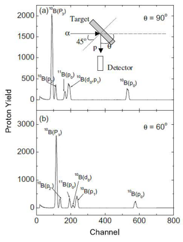

_Hình 3. Phổ năng lượng của proton từ phản ứng 10B(α,p)13C sử dụng boron tự nhiên, năng lượng chùm hạt alpha là 1.515 MeV \[10\]_

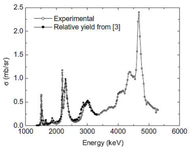

_Hình 4. Hàm kích thích của phản ứng 10B(α,p)13C \[10\]_

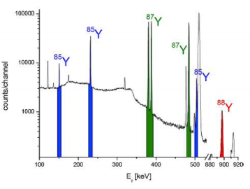

_Hình 5. Phổ gamma của mẫu Sr tự nhiên được chiếu bởi chùm proton 3 MeV \[2\]_

**2\. MÁY GIA TỐC TĨNH ĐIỆN PELLETRON 5SDH-2**

Pelletron 5SDH-2 là máy gia tốc tĩnh điện hiện đại, lần đầu có mặt tại Việt Nam, được lắp đặt tại Trường Khoa học Tự nhiên - Đại học Quốc gia Hà Nội. Đây là loại máy gia tốc tĩnh điện kép (Tandem), được sản xuất tại hãng National Electrostatics Corporation (NEC) - USA. Máy có điện áp gia tốc cực đại là 1.7 MV, do đó có thể gia tốc proton lên đến năng lượng 3.4 MeV, chùm hạt alpha lên đến 5.1 MeV. Hệ máy gia tốc 5SDH-2 Pelletron gồm có các bộ phận chính sau: nguồn ion, buồng gia tốc chính, hệ thống chân không, các bộ phận hội tụ, điều chỉnh chùm tia, kênh phân tích và kênh cấy ghép ion,...

Nguồn ion của máy gia tốc bao gồm hai loại: (1) Nguồn ion phún xạ cathode (SNICS) cho phép tạo ra các ion âm từ H đến Bi để gia tốc; (2) Nguồn ion âm trao đổi điện tích (RF) dùng để tạo ra ion H- và He- để gia tốc và tạo chùm hạt proton và alpha cho kênh phân tích \[12-14\].

Hiện tại máy gia tốc 5SDH-2 có 02 kênh chính: (1) Kênh sử dụng trong các kỹ thuật phân tích nguyên tố và cho các nghiên cứu khác như: Phổ kế tán xạ ngược Rutherford (RBS), phân tích phản ứng hạt nhân (NRA), Phân tích phát xạ tia X bởi hạt tích điện (PIXE), phân tích phát xạ gamma bởi hạt tích điện (PIGE); (2) Kênh cấy ghép ion. 

Hệ các detector trong buồng chiếu, đo của kênh phân tích bao gồm: 01t detector nhấp nháy NaI (Tl) được đặt sau vị trí của mẫu dùng cho hệ phân tích NRA; 02 detector Silicon hàng rào mặt SSB, một detector đặt ở vị trí góc tán xạ đối với chùm tia tới là 170o dùng cho phân tích RBS, detector thứ hai có thể quay theo mọi góc xung quanh mẫu; 01 detector tia X loại SDD đặt ở góc 38.4o so với hướng chùm tia tới từ mẫu dùng cho hệ phân tích PIXE. Các tín hiêu từ detector đi vào bộ khuếch đại và qua bộ chuyển đổi ADC và bộ phân tích biên độ nhiều kênh MCA. Phổ được ghi nhận và phân tích trên máy tính với các phần mềm chuyên dụng như MAESTRO, RC43, SIMNRA,..

Máy gia tốc Pelletron 5SDH-2 có thể sử dụng trong nhiều lĩnh vực nghiên cứu ứng dụng khác nhau như: nghiên cứu vật lý hạt nhân, vật lý ion nặng, vật lý thiên văn hạt nhân; Nghiên cứu nhiên liệu hạt nhân, hóa phóng xạ; Khoa học vật liệu, vật lý bán dẫn, vật lý bề mặt, ăn mòn hóa lý; Ứng dụng trong lĩnh vực khảo cổm, y học, sinh học, nông nghiệp, địa chất, môi trường, hải dương, khoa học hình sự và dấu vết tội phạm,… 

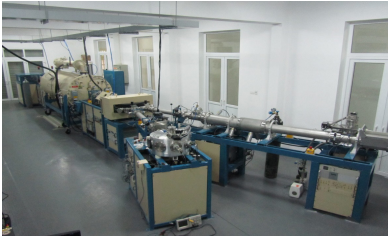

_Hình 6. Hình ảnh thực tế thiết bị gia tốc Pelletron 5SDH-2_

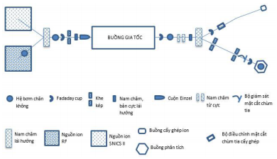

_Hình 7. Sơ đồ nguyên lý cấu tạo của máy gia tốc Pelletron 5SDH-2_

Hình 6, 7 là hình ảnh thực tế và sơ đồ nguyên lý cấu tạo của máy gia tốc Pelletron 5SDH-2 tại trường Đại học Khoa học tự nhiên - Đại học Quốc Gia Hà Nội.

Đối với các nghiên cứu phản ứng hạt nhân chúng ta cần phải biết chính xác là năng lượng của chùm hạt được gia tốc và độ phân giải năng lượng của nó. Thông thường đối với các máy gia tốc hạt, thông tin về năng lượng của chùm hạt được xác định qua các đại lượng trung gian liên quan đến các tham số của máy gia tốc. Tuy nhiên, giá trị năng lượng xác định bằng phương pháp này cho độ chính xác không cao, đặc biệt cho các nghiên cứu đòi hỏi cần phải biết năng lượng của chùm hạt với độ chính xác cao. Phương pháp sử dụng các phản ứng hạt nhân cộng hưởng để chuẩn năng lượng chùm hạt gia tốc là kỹ thuật được sử dụng phổ biến đối với các máy gia tốc Tandem.

N. T. Nghĩa và các cộng sự đã sử dụng phản ứng cộng hưởng 27Al(p,γ)28Si để hiệu chuẩn năng lượng của chùm proton trên máy gia tốc Pelletron 5SDH-2 \[12\].

**3\. TRIỂN VỌNG NGHIÊN CỨU VẬT LÝ HẠT NHÂN TRÊN MÁY GIA TỐC PELLETRON 5SDH-2**

Cho đến nay các nghiên cứu thực nghiệm về phản ứng hạt nhân gây bởi các chùm hạt tích điện được tạo ra trên các thiết bị gia tốc tại Việt Nam còn rất ít. Trên thiết bị gia tốc Pelletron 5SDH2, bên cạnh việc khai thác trong nghiên cứu ứng dụng các phương pháp và hệ thiết bị phân tích như RBS, PIXE, NRA trong việc nhận diện và xác định hàm lượng nguyên tố trong các đối tượng mẫu khác nhau. Một số nghiên cứu về tính chất các vật liệu, cấu trúc các mẫu vật như bề dày lớp, thành phần mẫu vật,... cũng đã được thực hiện trên thiết bị này.

N. T. Nghĩa và các cộng sự đã có một số kết quả nghiên cứu bước đầu về vật lý hạt nhân và các phương pháp, kỹ thuật phân tích trên máy gia tốc Pelletron \[12-15\]. T. T. Anh đã thực hiện nghiên cứu sơ bộ đo suất lượng và tiết diện của phản ứng 10B(p,α)7Be gây bởi chùm proton năng lượng từ 0.8 MeV đến 2.5 MeV bằng phương pháp kích hoạt và đo gamma tức thời \[16\].

Trong thời gian gần đây, các nghiên cứu về phản ứng hạt nhân liên quan đến vật lý thiên văn gây bởi các chùm hạt proton và alpha từ máy gia tốc 5SDH-2 Pelletron đã bắt đầu được thực hiện. Nhóm đề tài khoa học công nghệ cấp Quốc gia thuộc Chương trình phát triển Vật lý đến 2020 do TS. Lê Xuân Chung làm chủ nhiệm đang từng bước thực hiện các nội dung nghiên cứu về phản ứng hạt nhân ở vùng năng lượng thấp sử dụng trong thiên văn học trên hệ thiết bị gia tốc 5SDH2 Pelletron. Đề tài đã tập hợp được một đội ngũ đông đảo các cán bộ nghiên cứu vật lý hạt nhân thực nghiệm đến từ nhiều cơ sở nghiên cứu và đào tạo khác nhau trong nước như Viện Khoa học và Kỹ thuật hạt nhân, Trường Đại học Khoa học tự nhiên Hà Nội, Trung tâm VINAGAMMA cơ sở Đà Nẵng, Đại học Khoa học tự nhiên TP. Hồ Chính Minh. Nhóm nghiên cứu cũng đã nhận được sự giúp đỡ nhiệt tình của GS. Kubono từ trường Đại học Tổng hợp Tokyo. Các phản ứng được nghiên cứu trước hết là 10B(α,p)13C và 10B(p,α)7Be, ngoài ra, các phản ứng 10B(p,p’)10B và 10B(p,γ)11C\* cũng sẽ được quan tâm. Nhóm nghiên cứu đã có một số kết quả bước đầu trong việc thực hiện các tính toán mô phỏng, thiết kế thí nghiệm, xây dựng, lắp đặt hệ đo, chế tạo bia, và thực hiện các thí nghiệm thử nghiệm \[17\]. 

Bước đầu đã thu được có một số kết quả tính toán mô phỏng phản ứng 10B(α,p)13C sử dụng Geant4, với 2 module chính: (1) tính tiết diện tương tác của phản ứng và (2) tính hạt ở trạng thái cuối cùng cũng như phân bố động năng của chúng. Tiết diện toàn phần của phản ứng α+10,11B được tính toán bằng Talys 1.9 code (Hình 8), các giá trị này sẽ là đầu vào của chương trình Geant4.

Phổ năng lượng của chùm α trong bia Boron với các bề dày bia khác nhau (Hình 9). Để thiết kế hình học bố trí các detector của thí nghiệm, năng lượng của các hạt theo góc bay ra đã được tính toán. Kết quả mô phỏng phổ năng lượng của các hạt tích điện được ghi nhận bởi detector silicon tại góc 120o với bia có bề dày 10 µg/cm2 được biểu diễn trên Hình 10 \[18\].

Thí nghiệm đo suất lượng và tiết diện phản ứng 10B(α,p)13C sẽ được thực hiện với chùm hạt α có năng lượng từ 0.7-1.5 MeV, tại các góc khác nhau. Sơ đồ thí nghiệm được biểu diễn trên Hình 11, với aSi là các detector bán dẫn Si đo năng lượng hạt mang điện bay ra sau phản ứng, bia Boron tự nhiên được chế tạo dưới dạng lá mỏng, FC là Faraday cup nhằm đo cường độ hạt, bố trí thí nghiệm được đặt trong buồng chân không cao.

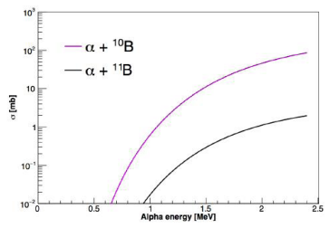

_Hình 8. Kết quả tính toán tiết diện toàn phần của các phản ứng α+10,11B bằng Talys 1.9 code_

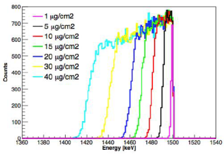

_Hình 9. Phổ năng lượng của chùm α trong bia Boron với các bề dày bia khác nhau_

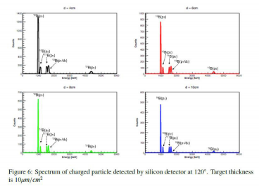

_Hình 10. Phổ của các hạt tích điện ghi nhận bởi detector Silicon tại góc 120o. Bia có bề dày 10 µg/cm2 \[18\]_

Để bổ sung cũng như nâng cao độ chính xác của số liệu về tiết diện đề xuất tiến hành thí nghiệm này với chùm proton có giải năng lượng từ 700 keV cho đến 3.4 MeV từ máy gia tốc 5SDH-2 Pelletron, việc đo bức xạ gamma và các hạt alpha bay ra được tiến hành đồng thời. Ngoài ra, các detector sẽ được bố trí xung quanh bia để đo sự phụ thuộc của tiết diện theo góc. Ở năng lượng Ep>3.2 MeV, có thể sẽ mở ra kênh phản ứng tạo ra 7 Be ở trạng thái kích thích cao hơn. Sơ đồ bố trí thí nghiệm được trình bày trên Hình 12.

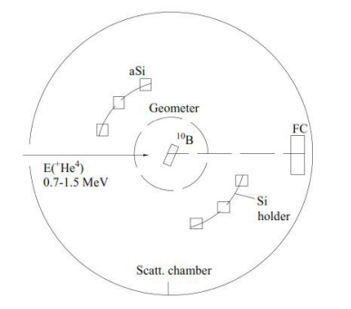

_Hình 11. Sơ đồ thí nghiệm đo phản ứng 10B(α,p)13C_

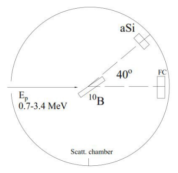

_Hình 12. Sơ đồ thí nghiệm đo phản ứng p+10B_

Trong nghiên cứu phản ứng hạt nhân, các hệ đo ngoài việc phải đạt được độ chính xác cao còn phải có tính linh động, đáp ứng được nhiều yêu cầu khác. Chính vì vậy, việc xây dựng một hệ đo từ việc lắp ghép các khối điện tử rời rạc là phương án tối ưu cho các thiết bị nghiên cứu thực nghiệm vật lý hạt nhân. Xu hướng chung của thế giới hiện nay là chuyển sang sử dụng các hệ VME để đạt được lợi thế về số lượng kênh mà hệ điện tử, cơ khí đi kèm không quá cồng kềnh. Nhóm đề tài thuộc Chương trình phát triển Vật lý do TS. Lê Xuân Chung làm chủ nhiệm đã thực hiện thành công việc thiết kế, xây dựng một hệ đo nhiều thông số tùy biến VME (Hình 13, 14) có thể sử dụng trong nhiều mục đích nghiên cứu vật lý hạt nhân khác nhau (Hình 15), \[17\]. Với hệ đo VME, khả năng đo đồng thời các hạt tích điện và tia gamma là khả thi. Trong tương lai, việc này cho phép nhóm nghiên cứu thực hiện nhiều bài toán vật lý hạt nhân phức tạp đòi hỏi việc nhận diện kênh phản ứng chính xác.

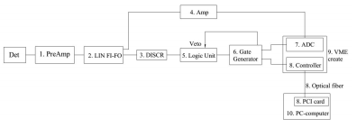

_Hình 13. Sơ đồ nguyên lý hệ đo nhiều thông số tùy biến VME_

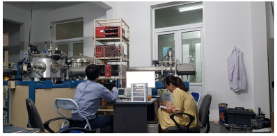

_Hình 14. Hình ảnh hệ đo nhiều thông số tùy biến VME_

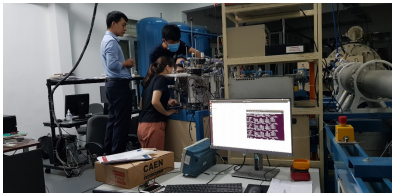

_Hình 15. Hình ảnh chuẩn bị thí nghiệm nghiên cứu phản ứng hạt nhân trên máy gia tốc Pelletron 5SDH-2 tại trường ĐH Khoa học tự nhiên Hà Nội_

**4\. KẾT LUẬN**

Với thiết bị gia tốc gia tốc Tandem Pelletron 5SDH-2 tại Trường Đại học Khoa học tự nhiên - Đại học Quốc gia Hà Nội và hệ các thiết bị ghi đo tùy biến nhiều thông số VME hiện đại đã được xây dựng tại Viện Khoa học và Kỹ thuật hạt nhân, cùng năng lực, kinh nghiệm và sự say mê nghiên cứu vật lý hạt nhân của đội ngũ cán bộ nghiên cứu trẻ của Việt Nam, khả năng thực hiện thành công các nghiên cứu về vật lý hạt nhân hiện đại nói chung, phản ứng hạt nhân ở vùng năng lượng thấp dùng trong vật lý thiên văn hạt nhân nói riêng đang thực sự được khởi động tại Việt Nam.

Trên cơ sở hiện có và sự quan tâm tiếp tục đầu tư nguồn lực thiết bị, nhân lực, kinh phí, trong thời gian tới phạm vi và hiệu quả khai thác máy gia tốc Pelletron 5SDH-2 trong nghiên cứu và ứng dụng tại Việt Nam sẽ ngày càng được mở rộng. 

_TÀI LIỆU THAM KHẢO_

_\[1\] Michael Wiescher, “The Four Lives of a Nuclear Accelerator”, Phys. Perspect. 19 (2017) 151–179._

_\[2\] Gy. Gyurky, Zs. Fulop et al., “The activation method for cross section measurements in nuclear astrophysics”, Eur. Phys. J. A (2019) 55: 41._

_\[3\] D.Tudor et al., “Facility for direct measurements for nuclear astrophysics at IFIN-HH - a 3 MV tandem accelerator and an ultra-low background laboratory”, Nucl. Inst. and Meth. in Phys. Res. B 953 (2020) 163178._

_\[4\] S. D. Pain , “Advances in instrumentation for nuclear astrophysics” AIP ADVANCES 4, 041015 (2014)._

_\[5\] M. Wiescher, R. J. de Boer, and J. Görres, “Low energy measurements of the 10B(p,α)7 Be reaction”, Physical Review C 95, 044617 (2017)._

_\[6\] A. Caciolli, R. Depalo et al. “A new study of 10B(p,α)7 Be reaction at low energies”, Eur. Phys. J. A (2016) 52: 136._

_\[7\] C. Spitaleri et al. “Measurement of the 10B(p,α0)7 Be cross section from 5 keV to 1.5 MeV in a single experiment using the Trojan horse method”. Physical Review C 95, 035801 (2017)._

_\[8\] Lombardo, D. Dell’Aquila, “New measurement of the 10B(p,α0)7 Be reaction cross section at low energies and the structure of 11C”, EPJ Web of Conferences, 117 7, 09009 (2016)._

_\[9\] H. Yamaguchi,... D. N. Binh, L. H. Khiem, N. N. Duy,” Alpha-resonance structure in 11C studied via resonant scattering of 7 Be+alpha and with the 7 Be(α,p) reaction. Physical Review C 87 (3) (2013) 034303._

_\[10\] H. Chen et al., “Cross-sections of 10B(α,p)13C nuclear reaction for boron analysis”, Nucl. Instr. Meth. B 211 (2003) 1._

_\[11\] T. Trivedi et al. “Ion Beam Facilities at the National Centre for Accelerator based Research using a 3 MV Pelletron Accelerator”, Physics Procedia 90 (2017) 100-106._

_\[12\] Nguyen The Nghia, Nguyen Thi Lan, Le Hong Khiem, Vi Ho Phong, Bui Van Loat, Tran The Anh. Using resonant nuclear reaction 27Al(p,γ)28Si to calibrate beam energy for pelletron accelerator 5SDH-2 at Hanoi University of Science: Nuclear Science and Technology - Vol. 3, No. 3 (2013)._

_\[13\] Nguyen The Nghia, Vu Thanh Mai, Bui Van Loat, “The model 5SDH-2 pelletron accelerator and application”. VNU Journal of Science, Mathematics-Physics, 27, 1S (2011) 180-184._

_\[14\] Le Hong Khiem, Vi Ho Phong, Nguyen The Nghia, “Calculation for optimization of the experimental conditions for RBS analysis at the HUS 5SDH-2 tandem accelerator”. IOP Science. Journal of Physics: Conference Series 627 (2015) 012005._

_\[15\] Nguyễn Thế Nghĩa: “Nghiên cứu ứng dụng một số phản ứng hạt nhân gây bởi chùm hạt tích điện trên máy gia tốc tĩnh điện trong phân tích”, Luận án Tiến sĩ, 2015._

_\[16\] Trần Thế Anh: “Bước đầu nghiên cứu phản ứng hạt nhân 10B(p,α) trên máy gia tốc 5SDH-2 tại Trường Đại học Khoa học tự nhiên”. Luận văn Thạc sĩ, 2013._

_\[17\] Lê Xuân Chung và cs “ Nghiên cứu cấu trúc hạt nhân và phản ứng hạt nhân trên các thiết bị lớn của Trung tâm nghiên cứu hạt nhân tiên tiến trên thế giới”. Đề tài KHCN cấp Quốc gia thuộc Chương trình phát triển Vật lý (2018-2020)._

_\[18\] Cuong Phan Viet, Anh Le Tuan, Chung Le Xuan, Ha Nguyen Hong, Thao Ho Thi and Khue Pham Duc, “Possibility for nuclear physics study based on Pelletron accelerator at Hanoi, Vietnam”, EPJ Web of Conferences 206 (2019) 08004._

 

Phạm Đức Khuê

_Viện Khoa học và Kỹ thuật hạt nhân_

_**Theo Tạp chí Khoa học công nghệ hạt nhân, số 63, 06/2020**_

 
